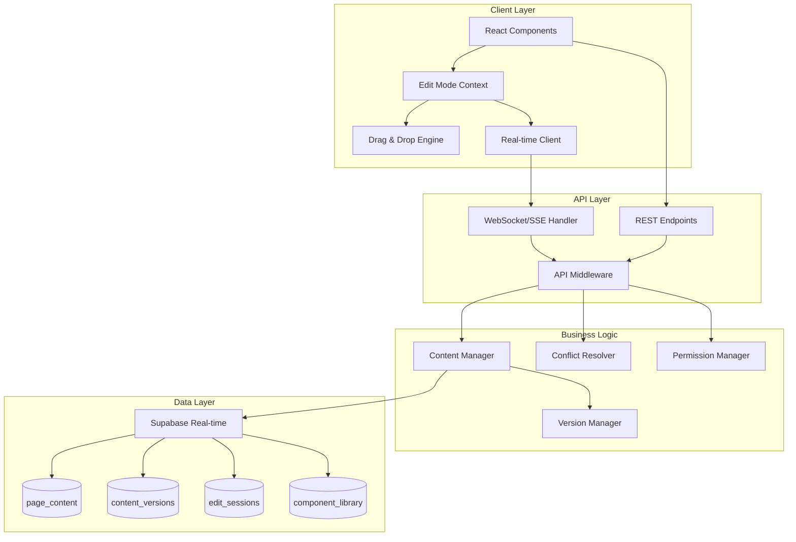

# Design Document: Real-time Collaborative Editing System

## Overview

This design extends the existing content management system to support real-time collaborative editing with drag-and-drop functionality, dynamic page creation, and robust conflict resolution. The solution leverages Supabase's real-time capabilities, builds upon the existing `page_content` and `content_versions` tables, and integrates seamlessly with the current edit mode context.

### Key Design Principles

1. **Incremental Enhancement**: Build upon existing architecture without breaking changes
2. **Real-time First**: All operations are designed for immediate synchronization
3. **Conflict-Aware**: Proactive conflict detection and resolution
4. **Performance Optimized**: Efficient data structures and minimal network overhead
5. **User Experience Focused**: Clear visual feedback and intuitive interactions

## Architecture

### High-Level Architecture



### Real-time Synchronization Strategy

**Chosen Approach: Hybrid Server-Authoritative with Optimistic Updates**

1. **Optimistic Updates**: Immediate local UI updates for responsiveness
2. **Server Authority**: Server validates and resolves conflicts
3. **Event Sourcing**: All changes tracked as events for audit and rollback
4. **Operational Transformation**: For text editing conflicts
5. **Last-Writer-Wins with Conflict Detection**: For structural changes

### Technology Stack Integration

- **Real-time Transport**: Supabase Real-time (WebSocket-based)
- **Conflict Resolution**: Custom CRDT-inspired system for components, OT for text
- **Drag & Drop**: React DnD with custom drop zones
- **State Management**: Enhanced EditModeContext with real-time subscriptions
- **API Pattern**: Existing `withCentralizedStateManagement` middleware

## Components and Interfaces

### 1. Enhanced Edit Mode Context

```typescript
interface EditModeContextType {
  // Existing properties
  isEditMode: boolean;
  toggleEditMode: () => void;
  saveContent: (key: string, value: any, type?: string, page?: string) => Promise<boolean>;
  isAdmin: boolean;
  isSaving: boolean;
  
  // New real-time properties
  isConnected: boolean;
  activeEditors: EditorPresence[];
  conflictedItems: ConflictItem[];
  
  // New collaborative methods
  subscribeToPage: (pageName: string) => void;
  unsubscribeFromPage: (pageName: string) => void;
  broadcastPresence: (componentId: string, action: 'editing' | 'idle') => void;
  resolveConflict: (conflictId: string, resolution: ConflictResolution) => Promise<void>;
  
  // Component management
  addComponent: (componentType: string, position: ComponentPosition) => Promise<string>;
  moveComponent: (componentId: string, newPosition: ComponentPosition) => Promise<void>;
  deleteComponent: (componentId: string) => Promise<void>;
  
  // Page management
  createPage: (pageData: NewPageData) => Promise<string>;
  updateNavigation: (navItems: NavigationItem[]) => Promise<void>;
}
```

### 2. Real-time Event System

```typescript
interface RealtimeEvent {
  id: string;
  type: 'content_change' | 'component_add' | 'component_move' | 'component_delete' | 
        'page_create' | 'nav_update' | 'presence_update' | 'conflict_detected';
  pageName: string;
  userId: string;
  timestamp: string;
  data: any;
  version: string;
}

interface EditorPresence {
  userId: string;
  userName: string;
  avatar?: string;
  componentId?: string;
  action: 'editing' | 'idle';
  lastSeen: string;
}

interface ConflictItem {
  id: string;
  type: 'content' | 'structure';
  componentId: string;
  localVersion: any;
  remoteVersion: any;
  conflictedAt: string;
  conflictedBy: string;
}
```

### 3. Component Library System

```typescript
interface ComponentDefinition {
  id: string;
  name: string;
  category: 'text' | 'media' | 'layout' | 'interactive';
  icon: string;
  defaultProps: Record<string, any>;
  schema: ComponentSchema;
  previewComponent: React.ComponentType;
  editComponent: React.ComponentType;
}

interface ComponentInstance {
  id: string;
  type: string;
  position: ComponentPosition;
  props: Record<string, any>;
  version: string;
  createdBy: string;
  createdAt: string;
  lastModifiedBy: string;
  lastModifiedAt: string;
}

interface ComponentPosition {
  pageId: string;
  sectionId: string;
  order: number;
  parentId?: string;
}
```

### 4. Drag and Drop System

```typescript
interface DropZone {
  id: string;
  type: 'section' | 'component' | 'trash';
  accepts: string[];
  position: ComponentPosition;
  isActive: boolean;
  isValid: boolean;
}

interface DragItem {
  type: 'new_component' | 'existing_component';
  componentType?: string;
  componentId?: string;
  sourcePosition?: ComponentPosition;
}
```

## Data Models

### Database Schema Extensions

```sql
-- Edit sessions for tracking active editors
CREATE TABLE edit_sessions (
  id UUID PRIMARY KEY DEFAULT gen_random_uuid(),
  user_id TEXT NOT NULL,
  page_name VARCHAR(100) NOT NULL,
  component_id VARCHAR(100),
  session_start TIMESTAMP WITH TIME ZONE DEFAULT NOW(),
  last_activity TIMESTAMP WITH TIME ZONE DEFAULT NOW(),
  status VARCHAR(20) DEFAULT 'active' CHECK (status IN ('active', 'idle', 'disconnected')),
  user_agent TEXT,
  ip_address INET
);

-- Component library definitions
CREATE TABLE component_library (
  id UUID PRIMARY KEY DEFAULT gen_random_uuid(),
  name VARCHAR(100) NOT NULL,
  category VARCHAR(50) NOT NULL,
  icon VARCHAR(100),
  default_props JSONB NOT NULL DEFAULT '{}',
  schema JSONB NOT NULL,
  is_active BOOLEAN DEFAULT true,
  created_at TIMESTAMP WITH TIME ZONE DEFAULT NOW(),
  updated_at TIMESTAMP WITH TIME ZONE DEFAULT NOW()
);

-- Component instances on pages
CREATE TABLE page_components (
  id UUID PRIMARY KEY DEFAULT gen_random_uuid(),
  page_name VARCHAR(100) NOT NULL,
  component_type VARCHAR(100) NOT NULL,
  component_id VARCHAR(100) NOT NULL UNIQUE,
  position_section VARCHAR(100) NOT NULL,
  position_order INTEGER NOT NULL,
  parent_component_id VARCHAR(100),
  props JSONB NOT NULL DEFAULT '{}',
  version VARCHAR(50) NOT NULL,
  created_by TEXT NOT NULL,
  created_at TIMESTAMP WITH TIME ZONE DEFAULT NOW(),
  last_modified_by TEXT NOT NULL,
  last_modified_at TIMESTAMP WITH TIME ZONE DEFAULT NOW(),
  is_active BOOLEAN DEFAULT true
);

-- Navigation structure
CREATE TABLE navigation_items (
  id UUID PRIMARY KEY DEFAULT gen_random_uuid(),
  page_name VARCHAR(100) NOT NULL,
  display_name VARCHAR(100) NOT NULL,
  url_slug VARCHAR(100) NOT NULL UNIQUE,
  parent_id UUID REFERENCES navigation_items(id),
  order_index INTEGER NOT NULL,
  is_visible BOOLEAN DEFAULT true,
  is_active BOOLEAN DEFAULT true,
  created_at TIMESTAMP WITH TIME ZONE DEFAULT NOW(),
  updated_at TIMESTAMP WITH TIME ZONE DEFAULT NOW()
);

-- Conflict resolution log
CREATE TABLE conflict_resolutions (
  id UUID PRIMARY KEY DEFAULT gen_random_uuid(),
  page_name VARCHAR(100) NOT NULL,
  component_id VARCHAR(100),
  conflict_type VARCHAR(50) NOT NULL,
  local_version VARCHAR(50),
  remote_version VARCHAR(50),
  resolution_strategy VARCHAR(50) NOT NULL,
  resolved_by TEXT NOT NULL,
  resolved_at TIMESTAMP WITH TIME ZONE DEFAULT NOW(),
  resolution_data JSONB
);

-- Indexes for performance
CREATE INDEX idx_edit_sessions_user_page ON edit_sessions(user_id, page_name);
CREATE INDEX idx_edit_sessions_activity ON edit_sessions(last_activity);
CREATE INDEX idx_page_components_page ON page_components(page_name);
CREATE INDEX idx_page_components_order ON page_components(page_name, position_section, position_order);
CREATE INDEX idx_navigation_order ON navigation_items(parent_id, order_index);
```

### Enhanced Content Versioning

```sql
-- Add real-time tracking to existing content_versions
ALTER TABLE content_versions ADD COLUMN IF NOT EXISTS 
  conflict_resolution_id UUID REFERENCES conflict_resolutions(id);

ALTER TABLE content_versions ADD COLUMN IF NOT EXISTS 
  event_type VARCHAR(50) DEFAULT 'manual_edit';

ALTER TABLE content_versions ADD COLUMN IF NOT EXISTS 
  session_id UUID REFERENCES edit_sessions(id);

-- Add optimistic locking to page_content
ALTER TABLE page_content ADD COLUMN IF NOT EXISTS 
  lock_version INTEGER DEFAULT 1;

ALTER TABLE page_content ADD COLUMN IF NOT EXISTS 
  locked_by TEXT;

ALTER TABLE page_content ADD COLUMN IF NOT EXISTS 
  locked_at TIMESTAMP WITH TIME ZONE;
```

## Error Handling

### Concurrency Error Analysis and Resolution

**Root Cause Investigation:**
1. **Race Conditions**: Multiple users updating same content simultaneously
2. **Stale State**: Frontend showing outdated version while backend has newer version
3. **Session Conflicts**: Multiple admin sessions without proper coordination
4. **Optimistic Lock Failures**: Version mismatches during concurrent updates

**Resolution Strategy:**

```typescript
class ConcurrencyErrorResolver {
  async detectConflict(
    pageName: string, 
    contentKey: string, 
    expectedVersion: string
  ): Promise<ConflictDetectionResult> {
    // Check current version against expected
    const currentVersion = await this.getCurrentVersion(pageName, contentKey);
    
    if (currentVersion !== expectedVersion) {
      return {
        hasConflict: true,
        conflictType: 'version_mismatch',
        currentVersion,
        expectedVersion,
        conflictedBy: await this.getLastEditor(pageName, contentKey)
      };
    }
    
    return { hasConflict: false };
  }
  
  async resolveConflict(
    conflictId: string, 
    strategy: 'accept_remote' | 'keep_local' | 'merge'
  ): Promise<ConflictResolution> {
    // Implementation based on strategy
    switch (strategy) {
      case 'accept_remote':
        return await this.acceptRemoteChanges(conflictId);
      case 'keep_local':
        return await this.keepLocalChanges(conflictId);
      case 'merge':
        return await this.mergeChanges(conflictId);
    }
  }
}
```

### Error Recovery Mechanisms

1. **Automatic Retry**: Failed operations retry with exponential backoff
2. **Graceful Degradation**: Offline mode with local storage queue
3. **State Reconciliation**: Periodic sync to resolve inconsistencies
4. **User Notification**: Clear error messages with recovery options

## Testing Strategy

### Unit Tests
- Component rendering and interaction
- Conflict resolution algorithms
- Version management logic
- Permission validation

### Integration Tests
- Real-time event flow
- Database transaction integrity
- API endpoint functionality
- WebSocket connection handling

### End-to-End Tests
- Multi-user editing scenarios
- Drag and drop operations
- Page creation workflow
- Conflict resolution UI

### Performance Tests
- Concurrent user load testing
- Real-time message throughput
- Database query optimization
- Memory usage under load

### Concurrency Tests (Specific to Error Resolution)
```typescript
describe('Concurrency Error Resolution', () => {
  test('should handle simultaneous edits without data loss', async () => {
    // Simulate two users editing same component
    const user1Edit = editComponent('comp1', 'new value 1');
    const user2Edit = editComponent('comp1', 'new value 2');
    
    const results = await Promise.allSettled([user1Edit, user2Edit]);
    
    // One should succeed, one should conflict
    expect(results.filter(r => r.status === 'fulfilled')).toHaveLength(1);
    expect(results.filter(r => r.status === 'rejected')).toHaveLength(1);
    
    // Verify conflict is properly recorded
    const conflicts = await getActiveConflicts('comp1');
    expect(conflicts).toHaveLength(1);
  });
});
```

## Monitoring and Metrics

### Key Performance Indicators
- **Real-time Latency**: Message delivery time (target: <200ms)
- **Conflict Rate**: Percentage of operations resulting in conflicts (target: <5%)
- **Resolution Time**: Time to resolve conflicts (target: <30s)
- **Connection Stability**: WebSocket connection uptime (target: >99%)
- **User Experience**: Time from action to visual feedback (target: <100ms)

### Monitoring Implementation
```typescript
interface RealtimeMetrics {
  messageLatency: number[];
  conflictRate: number;
  activeConnections: number;
  operationsPerSecond: number;
  errorRate: number;
}

class MetricsCollector {
  trackMessageLatency(sentAt: number, receivedAt: number) {
    const latency = receivedAt - sentAt;
    this.metrics.messageLatency.push(latency);
    
    if (latency > 500) {
      console.warn(`High latency detected: ${latency}ms`);
    }
  }
  
  trackConflict(conflictType: string, resolutionTime: number) {
    this.metrics.conflictRate = this.calculateConflictRate();
    
    // Alert if conflict rate exceeds threshold
    if (this.metrics.conflictRate > 0.05) {
      this.alertHighConflictRate();
    }
  }
}
```

## Security Considerations

### Authentication and Authorization
- **Session Validation**: Verify user permissions for each operation
- **Role-Based Access**: Different capabilities for admin/editor/viewer roles
- **Operation Validation**: Server-side validation of all changes

### Data Protection
- **Input Sanitization**: All user input sanitized before storage
- **XSS Prevention**: Content properly escaped in UI
- **CSRF Protection**: Token validation for state-changing operations

### Real-time Security
- **Connection Authentication**: WebSocket connections authenticated
- **Message Validation**: All real-time messages validated
- **Rate Limiting**: Prevent abuse of real-time endpoints

## Deployment and Rollback Strategy

### Phased Rollout
1. **Phase 1**: Backend infrastructure and database changes
2. **Phase 2**: Basic real-time functionality without UI changes
3. **Phase 3**: Enhanced edit mode with conflict resolution
4. **Phase 4**: Drag and drop and page creation features
5. **Phase 5**: Full collaborative editing with presence indicators

### Feature Flags
```typescript
interface FeatureFlags {
  realtimeEditing: boolean;
  dragAndDrop: boolean;
  pageCreation: boolean;
  conflictResolution: boolean;
  presenceIndicators: boolean;
}
```

### Rollback Plan
- **Database Rollback**: Migration scripts for schema changes
- **Feature Disable**: Feature flags to disable problematic features
- **Cache Invalidation**: Clear cached content to force refresh
- **User Communication**: Clear messaging about temporary limitations

This design provides a comprehensive foundation for implementing real-time collaborative editing while maintaining system stability and user experience quality.