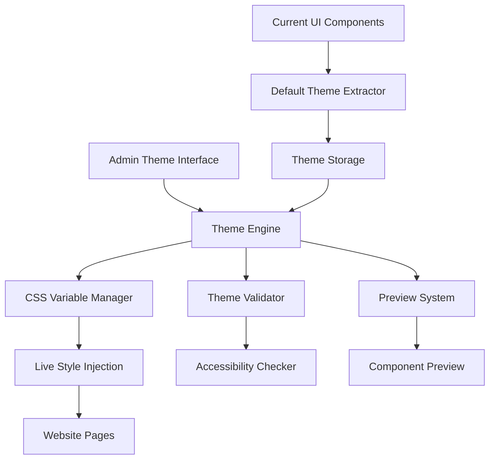

# Theme Management System Design Document

## Overview

The rebuilt theme management system will provide a comprehensive solution for managing the visual appearance of the driving school website while preserving the current professional design as the default. The system will extract existing design patterns (emerald/teal gradients, backdrop blur effects, rounded corners, shadows) and codify them into a flexible theme engine that allows customization without compromising visual quality.

## Architecture

### System Components



### Core Architecture Principles

1. **Non-destructive Design**: Current UI remains untouched, system overlays theme variables
2. **CSS Custom Properties**: Leverage CSS variables for real-time theme switching
3. **Component Compatibility**: Work with existing Tailwind classes and component structure
4. **Progressive Enhancement**: Theme system enhances existing design without breaking functionality

## Components and Interfaces

### 1. Theme Extractor Service

**Purpose**: Analyze current UI components and extract design patterns as default theme

```typescript
interface ThemeExtractor {
  extractGradients(): GradientConfig[];
  extractColors(): ColorPalette;
  extractTypography(): TypographyConfig;
  extractEffects(): EffectConfig;
  generateDefaultTheme(): Theme;
}

interface GradientConfig {
  name: string;
  direction: string;
  colorStops: ColorStop[];
  usage: 'hero' | 'card' | 'button' | 'background';
}

interface ColorStop {
  color: string;
  position: number;
}
```

**Implementation Strategy**:
- Parse existing component files to identify gradient patterns
- Extract color values from current emerald/teal scheme
- Catalog backdrop blur, shadow, and border radius values
- Generate theme configuration that reproduces current appearance exactly

### 2. Theme Engine

**Purpose**: Core system for managing and applying themes

```typescript
interface ThemeEngine {
  loadTheme(themeId: string): Promise<Theme>;
  applyTheme(theme: Theme): void;
  validateTheme(theme: Theme): ValidationResult;
  generatePreview(theme: Theme): PreviewData;
  saveTheme(theme: Theme): Promise<string>;
}

interface Theme {
  id: string;
  name: string;
  colors: ColorPalette;
  gradients: GradientSet;
  typography: TypographyConfig;
  effects: EffectConfig;
  metadata: ThemeMetadata;
}
```

### 3. CSS Variable Manager

**Purpose**: Handle real-time CSS custom property updates

```typescript
interface CSSVariableManager {
  updateVariables(variables: Record<string, string>): void;
  getComputedVariables(): Record<string, string>;
  resetToDefault(): void;
  validateVariables(variables: Record<string, string>): boolean;
}
```

**CSS Variable Structure**:
```css
:root {
  /* Primary Colors */
  --theme-primary-50: #ecfdf5;
  --theme-primary-500: #10b981;
  --theme-primary-900: #064e3b;
  
  /* Gradients */
  --theme-gradient-hero: linear-gradient(135deg, var(--theme-primary-900), var(--theme-secondary-800));
  --theme-gradient-card: linear-gradient(135deg, var(--theme-primary-500), var(--theme-secondary-600));
  
  /* Effects */
  --theme-backdrop-blur: blur(12px);
  --theme-shadow-card: 0 20px 25px -5px rgba(0, 0, 0, 0.1);
  --theme-border-radius: 1.5rem;
}
```

### 4. Admin Theme Interface

**Purpose**: Provide intuitive interface for theme management

```typescript
interface AdminThemeInterface {
  renderColorPicker(colorKey: string): JSX.Element;
  renderGradientEditor(gradientKey: string): JSX.Element;
  renderTypographyControls(): JSX.Element;
  renderEffectControls(): JSX.Element;
  renderPreview(): JSX.Element;
  renderPresetSelector(): JSX.Element;
}
```

**Interface Features**:
- Real-time color picker with gradient preview
- Typography controls with live text preview
- Effect sliders for blur, shadow, and opacity
- Side-by-side before/after comparison
- Preset theme gallery with thumbnails

### 5. Preview System

**Purpose**: Show theme changes without affecting live site

```typescript
interface PreviewSystem {
  generatePreview(theme: Theme): PreviewData;
  renderComponentPreviews(theme: Theme): ComponentPreview[];
  compareThemes(current: Theme, modified: Theme): ComparisonData;
}

interface ComponentPreview {
  component: 'hero' | 'card' | 'form' | 'button';
  html: string;
  styles: string;
}
```

## Data Models

### Theme Configuration

```typescript
interface ColorPalette {
  primary: ColorScale;
  secondary: ColorScale;
  accent: ColorScale;
  neutral: ColorScale;
  semantic: SemanticColors;
}

interface ColorScale {
  50: string;
  100: string;
  200: string;
  300: string;
  400: string;
  500: string;
  600: string;
  700: string;
  800: string;
  900: string;
}

interface GradientSet {
  hero: GradientConfig;
  card: GradientConfig;
  button: GradientConfig;
  background: GradientConfig;
  accent: GradientConfig;
}

interface TypographyConfig {
  fontFamily: {
    sans: string[];
    serif: string[];
    mono: string[];
  };
  fontSize: FontSizeScale;
  fontWeight: FontWeightScale;
  lineHeight: LineHeightScale;
}

interface EffectConfig {
  backdropBlur: {
    sm: string;
    md: string;
    lg: string;
    xl: string;
  };
  boxShadow: {
    card: string;
    button: string;
    modal: string;
    hero: string;
  };
  borderRadius: {
    sm: string;
    md: string;
    lg: string;
    xl: string;
    full: string;
  };
}
```

### Default Theme Extraction

The system will extract the following patterns from current components:

**From Contact Page**:
- Hero gradient: `from-emerald-900 via-teal-800 to-blue-900`
- Card backgrounds: `bg-white/80 backdrop-blur-sm`
- Button gradients: `from-emerald-500 to-teal-600`
- Shadow effects: `shadow-2xl hover:shadow-emerald-500/25`

**From About Page**:
- Badge styles: `bg-emerald-500/20 backdrop-blur-sm border border-emerald-400/30`
- Image treatments: `rounded-3xl overflow-hidden shadow-2xl`
- Floating elements: `bg-white rounded-2xl p-6 shadow-2xl`

**From Reviews Page**:
- Stats cards: `bg-white/10 backdrop-blur-sm rounded-xl`
- Review cards: `bg-white/90 backdrop-blur-sm rounded-2xl`
- Filter buttons: `bg-gradient-to-r from-emerald-500 to-teal-600`

**From Admin Dashboard**:
- Sidebar gradients: `bg-gradient-to-br from-emerald-900 to-teal-800`
- Navigation buttons: `hover:bg-emerald-700/50 rounded-xl`
- Header styling: Professional emerald/teal theme

## Error Handling

### Theme Validation

```typescript
interface ValidationResult {
  isValid: boolean;
  errors: ValidationError[];
  warnings: ValidationWarning[];
}

interface ValidationError {
  field: string;
  message: string;
  severity: 'error' | 'warning';
}
```

**Validation Rules**:
1. **Accessibility**: Ensure contrast ratios meet WCAG AA standards
2. **Color Harmony**: Validate color combinations don't clash
3. **Gradient Integrity**: Ensure gradients have proper color stops
4. **Typography Readability**: Verify text remains readable on all backgrounds
5. **Effect Compatibility**: Check backdrop blur and shadow combinations

### Fallback Mechanisms

1. **Invalid Theme**: Revert to default theme automatically
2. **CSS Variable Failure**: Provide inline style fallbacks
3. **Preview Generation Error**: Show static preview images
4. **Storage Failure**: Use localStorage as backup
5. **Network Issues**: Cache themes locally for offline editing

## Testing Strategy

### Unit Testing

1. **Theme Extractor**: Test pattern recognition and default theme generation
2. **CSS Variable Manager**: Test variable updates and validation
3. **Theme Engine**: Test theme loading, validation, and application
4. **Color Utilities**: Test color manipulation and accessibility functions

### Integration Testing

1. **Component Compatibility**: Ensure themes work with all existing components
2. **Real-time Updates**: Test live preview and application
3. **Storage Persistence**: Test theme saving and loading
4. **Cross-browser Compatibility**: Test CSS variable support

### Visual Regression Testing

1. **Default Theme Accuracy**: Ensure extracted theme matches current appearance exactly
2. **Theme Variations**: Test preset themes maintain visual quality
3. **Component Rendering**: Verify all components render correctly with theme changes
4. **Responsive Behavior**: Test themes across different screen sizes

### User Acceptance Testing

1. **Admin Interface Usability**: Test theme editing workflow
2. **Preview Accuracy**: Ensure previews match applied themes
3. **Performance Impact**: Measure theme switching performance
4. **Accessibility Compliance**: Test with screen readers and accessibility tools

## Implementation Phases

### Phase 1: Foundation (Default Theme Extraction)
- Build theme extractor to analyze current components
- Generate default theme configuration
- Implement CSS variable system
- Create basic theme engine

### Phase 2: Admin Interface
- Build theme management UI in admin dashboard
- Implement color pickers and gradient editors
- Add typography and effect controls
- Create preview system

### Phase 3: Theme Variations
- Develop preset theme system
- Create seasonal and branded variations
- Implement theme import/export
- Add theme validation and error handling

### Phase 4: Enhancement and Polish
- Optimize performance
- Add advanced features (theme scheduling, A/B testing)
- Implement comprehensive testing
- Documentation and training materials

## Performance Considerations

1. **CSS Variable Efficiency**: Use CSS custom properties for instant updates
2. **Preview Generation**: Cache preview renders to avoid repeated computation
3. **Theme Storage**: Compress theme data for faster loading
4. **Lazy Loading**: Load theme assets only when needed
5. **Memory Management**: Clean up unused theme data and event listeners

## Security Considerations

1. **Input Validation**: Sanitize all color and CSS values
2. **XSS Prevention**: Validate CSS injection attempts
3. **Access Control**: Restrict theme management to admin users
4. **Audit Trail**: Log all theme changes for accountability
5. **Backup Strategy**: Maintain theme backups for recovery